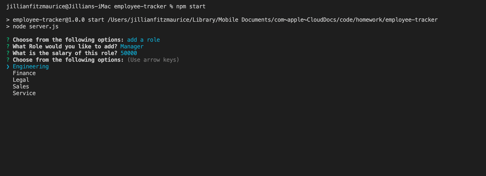
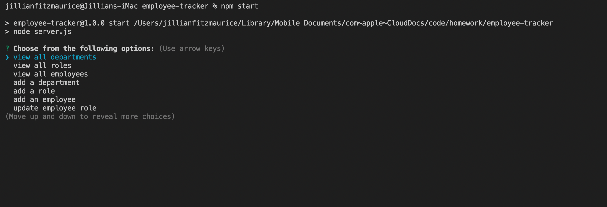

# Employee Tracker

### Github : https://github.com/shyfidelity

### Walkthrough video : 
### Link to read me: https://github.com/ShyFidelity/employee-tracker
### see index.html for deployed 

## Description
This is an application used to keep track of employees, their salaries, roles and what department they are in. You are able to change and add data to each category. 

## What was learned
For this project we used mySQL, and mySQL2, and inquirer. We used a schema to create our database and tables and a seeds file to start inserting some starter files. 

## Usage
- This application will allow user to add an role, an employee, and different characteristics about each of them
- Users will be prompted via inquirer to update information about a role, or a new employee 
- All data will be stored in an SQL database  
- we will use mySQL2 to connect the data from inquirer prompts to connect it to the databases 

## Screenshots

## Technologies Use

<a href="https://nodejs.org/">Node.js</a>

<a href="https://www.npmjs.com/">NPM</a>

<a href="https://www.npmjs.com/package/inquirer">Inquirer.js</a>

<a href="https://www.mysql.com/">mySQL</a>

<a href="https://www.npmjs.com/package/mysql2">mySQL2</a>

<a href="https://www.npmjs.com/package/console.table">console</a>

